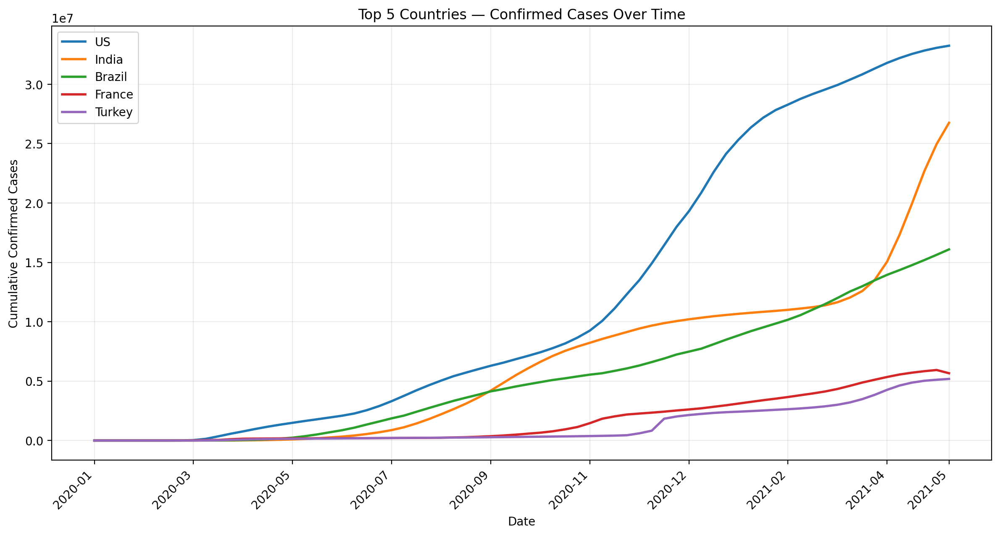

# COVID-19-Global-Data-Analysis-
Tracking case, death, and recovery trends across 190+ countries using Python
# COVID-19 Global Data Analysis — Tracking case, death, and recovery trends across 190+ countries using Python


## 📌 Overview

Understanding how COVID-19 spread and impacted different countries required consolidating messy, wide-format time-series data into something analyzable. This project cleans, reshapes, and merges global confirmed case, death, and recovery data to compare pandemic trajectories across countries and identify peak periods, death rates, and recovery patterns.

## 📊 Dataset

- **Source:** Johns Hopkins CSSE COVID-19 time-series datasets (confirmed cases, deaths, recovered)
- **Size:** Daily data across 190+ countries and regions
- **Period covered:** January 2020 – May 2021

## 🛠️ Tools & Techniques

- **Tool:** Python (Pandas, NumPy, Matplotlib, Jupyter Notebook)
- **Key techniques:** `melt` (wide-to-long reshaping), `merge`, `groupby`, `diff` (daily change calculation), `pivot`, time-series visualization

## 🔍 Approach

1. Cleaned and reshaped 3 wide-format datasets (confirmed, deaths, recovered) into a unified long-format time series using `pandas.melt`.
2. Handled missing province/state values, converted lat/long and date fields, and merged all 3 datasets on country and date.
3. Engineered daily and monthly trend metrics using `.diff()` and `.groupby()`, including daily new cases, daily deaths, and monthly aggregated totals.
4. Visualized results with 10+ Matplotlib charts — country comparisons, provincial breakdowns, recovery ratios, and death-rate rankings.

## 💡 Key Insights

- The US led global totals with **33.2M confirmed cases** and **594K deaths** — the highest of any country in the dataset.
- **Mexico** had the highest 2020 death rate (**8.82%**) among major economies, more than 3x the global average.
- **South Africa** recorded **1.55M total recoveries** against **56K deaths** — a recovery rate of roughly **96.5%**.
- Germany, France, and Italy hit their peak daily new-case surges on different dates (**Dec 30 2020**, **Apr 11 2021**, and **Nov 13 2020** respectively) — mapping distinct pandemic wave timing across Europe.
- Within Canada, **Quebec** had the highest provincial death rate at **3.01%**.

## 📷 Dashboard Preview



*Add your top-5-countries line chart or the US daily-deaths plot here — these are the most visually compelling outputs from the notebook.*

## 📁 Repository Structure

```
├── README.md
├── notebooks/
│   └── Covid-19-Project.ipynb   # full analysis notebook
├── data/
│   ├── covid_19_confirmed.csv
│   ├── covid_19_deaths.csv
│   └── covid_19_recovered.csv
├── images/
│   └── charts/                  # exported chart images
└── requirements.txt
```

## ▶️ How to Reproduce

**Python:**
```bash
pip install -r requirements.txt
jupyter notebook notebooks/Covid-19-Project.ipynb
```

`requirements.txt` should include: `pandas`, `numpy`, `matplotlib`, `jupyter`

## 👤 Author

**Shubham Kumar Gupta**
Data Analyst | [LinkedIn](https://www.linkedin.com/in/shubham-kumar-gupta-a4551b191) | [GitHub](https://github.com/shubamkumargupta-123)
